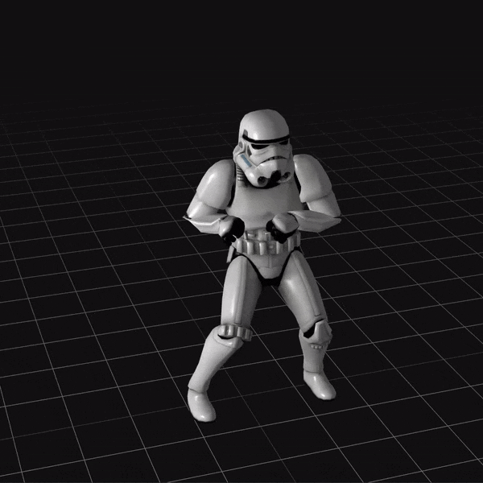

# TDC São Paulo 2020

## VueGL para renderização reativa de gráficos 3D WebGL com Vue e Three

> Demonstração construída com Vue.js e Nuxt.js, para exibição de exemplos com VueGL, criada como material de apoio para _talk_ na trilha [JavaScript](https://thedevconf.com/tdc/2020/sampaonline/trilha-javascript) do [The Developer's Conferece São Paulo 2020](https://thedevconf.com/tdc/2020/sampaonline/).

Antes de prosseguir e se aprofundar direto no código, caso desejado, também é possível baixar os [_slides_ em PPSX](./static/talk.ppsx) utilizados durante a _talk_, para revisar as explicações teóricas.

Quer apenas ver a aplicação rodando? Pode acessar [a demonstração](https://tdcsp2020-vuegl.netlify.app/).

### Instruções

Embora um requisito comum, sempre vale lembrar: tenha certeza de que o [Node](https://nodejs.org/) está pronto para execução em seu ambiente de desenvolvimento antes de começar. Então, após clonar este repositório, execute em um terminal no diretório raiz do projeto:

``` bash
# instalar dependências
$ npm install

# servir com hot-reload em localhost:3000
$ npm run dev

# construir para produção e iniciar servidor
$ npm run build
$ npm start
```

## Publicação

[](https://app.netlify.com/sites/tdcsp2020-vuegl/deploys)

Este projeto é automaticamente publicado através da [Netlify](https://netlifly.com) quando novidades chegam no _branch_ `master`.

## Saiba mais

Para explicações detalhadas sobre como as coisas funcionam, dê uma olhada na [documentação do Nuxt.js](https://nuxtjs.org), na [documentação do Three.js](https://threejs.org/docs/) e na [documentação do VueGL](https://vue-gl.github.io/guide/).

**Ainda está com alguma dúvida?** Participe das [comunidades Vue.js Brasil](https://github.com/vuejs-br/comunidades) e procupre pelo autor desta _talk_ ou outros experientes apoiadores do [Vue.js](https://br.vuejs.org/) em nosso país.

## Licença

Copyright &copy; 2020.

Licenciado nos termos da [licença MIT](LICENSE).
